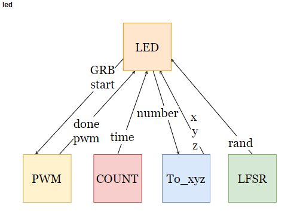
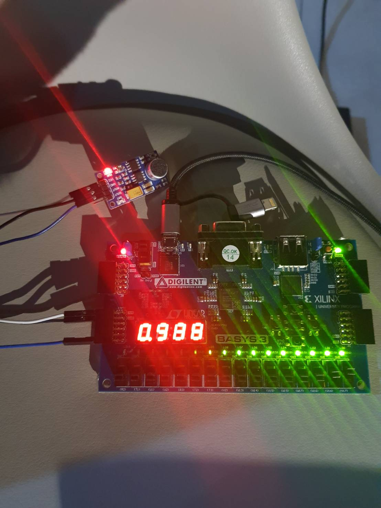
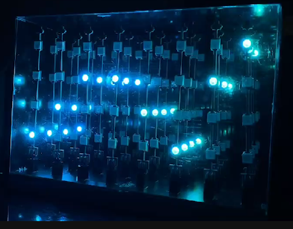
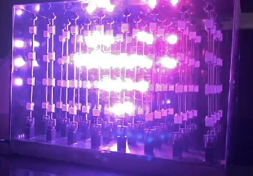
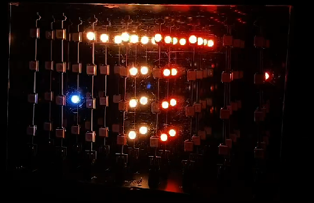

# Music-Light-Cube

### NTHU 110 10 EECS 207001 Logic Design Laboratory Final Project

### Final Project Competition Second Prize

### Contributor
- 陳寬宸
- 陳家輝

### Architecture

### Sound Sensor Demo

### Music Light Cube Demo

### More Detail

Please refer to [Report](./Team25_Final_Project_Report.pdf)
